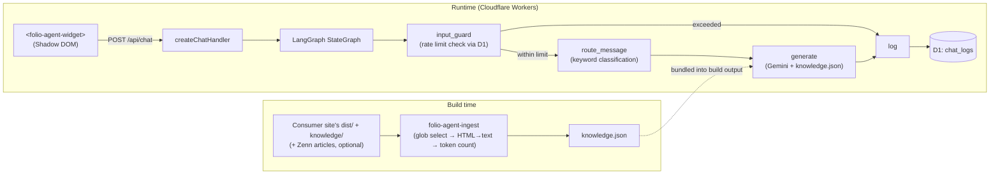

[🇯🇵 日本語](README.md) | [🇬🇧 English](README.en.md)

# folio-agent

[](https://github.com/yktsnet/folio-agent/actions/workflows/ci.yml)

An npm package that provides a portfolio reception chatbot for static sites + Cloudflare Workers, answering with a **CAG (search-free full-context) approach** that bundles the entire knowledge base into the system prompt at build time.

> Published on npm. Install with `npm install @folio-agent/widget @folio-agent/handler`.

## Quick Start

### Prerequisites

- A Cloudflare account (Workers + D1)
- A target site with a static build (one that outputs `dist/`)

### Setup

```bash
npm install @folio-agent/widget @folio-agent/handler
npx folio-agent-init
```

`folio-agent-init` is an interactive wizard. It asks about language (JA/EN), URL globs to include in the knowledge base, Zenn integration, Contact URL, and 3 theme colors and a Gemini API key, then generates/modifies the following:

- `folio-agent.config.json` (ingest config + wizard answers)
- `folio-agent.theme.css` (CSS custom properties for the 3 theme colors)
- An API route stub (default `functions/api/chat.ts`; existing files are left untouched)
- An appended `folio-agent-ingest` call in the `package.json` `build` script
- `GEMINI_API_KEY` in `.dev.vars`

Only one manual step remains. Paste the snippet shown on completion (the widget tag + the `folio-agent.theme.css` link) into your site's layout, once.

To fine-tune the theme, edit `folio-agent.theme.css` directly or re-run `npx folio-agent-init`; changes reflect immediately in your site's dev server. Re-running asks all questions again with the current values as defaults, and shows you a diff before writing.

If you'd rather configure things by hand instead of using the wizard, see [Usage](#usage--api).

## Overview

When the knowledge source fits into a single site plus a handful of supplementary Markdown files, setting up a vector search infrastructure tends to be overkill. folio-agent has no search step — it answers using a CAG (Cache-Augmented Generation) approach that bundles the entire knowledge base into the system prompt at build time. There's a threshold beyond which switching to RAG should be considered as the knowledge base grows (see [Design Decisions](#design-decisions) for details).

It's developed as an npm package independent of any particular site, and is grown by validating its behavior through integration into a real site.

## Architecture



## Tech Stack

| Layer | Technology | Reason |
|---|---|---|
| Runtime | Cloudflare Workers | D1, `CF-Connecting-IP`, and a free tier all come together natively on Workers, with no additional infrastructure needed |
| Backend | LangGraph.js (`StateGraph` only) | The input guard → routing → generation → logging branching logic can be expressed declaratively with `StateGraph` |
| Knowledge design | CAG (full-context, no search) | The knowledge source is small (one site + a few supplements), so adding a vector search infrastructure was judged overkill |
| Knowledge selection | dist traversal + URL path globs (`picomatch`) | Reading is done via file access (no crawling needed); the selector is a URL, so the user only needs to know their own site's URL structure |
| Generation | Gemini API (default `gemini-3.1-flash-lite`) | A free tier that keeps costs at zero for an always-on public service. See [Design Decisions](#design-decisions) for details |
| Frontend | Web Components (Shadow DOM, framework-agnostic) | Works regardless of the host framework and avoids CSS style collisions |
| Monorepo | npm workspaces | At the scale of two lightly-dependent packages, pnpm's advantages don't pay off, so we prioritized a setup that doesn't require extra tooling (corepack, etc.). See [Design Decisions](#design-decisions) for details |

## Usage / API

### 1. Knowledge Generation (build time)

```bash
npx folio-agent-ingest folio-agent.config.json knowledge.json
```

```jsonc
// folio-agent.config.json
{
  "distDir": "dist",
  "include": ["/", "/works/**", "/about"],
  "exclude": ["/works/draft-*"],
  "knowledgeDir": "knowledge"
}
```

`IngestConfig` (`distDir` / `include` / `exclude` / `knowledgeDir` / `zenn` / `tokenWarningThreshold`) is exported as a type from `@folio-agent/handler`. `language` and `theme` are fields that `folio-agent-init` uses to persist the wizard's answers; ingest itself doesn't read them. Markdown placed under `knowledgeDir` follows a directory structure mirroring URL paths, and is outside the scope of include/exclude (only what you explicitly place there is included).

To include Zenn articles in the knowledge base, specify `zenn` (omit it to skip). No requests are made to zenn.dev; instead, the Zenn CLI's local `articles/` directory is read, and only articles whose frontmatter has `published: true` are ingested:

```jsonc
// folio-agent.config.json (excerpt)
{
  "zenn": {
    "articlesDir": "../zenn-content/articles",
    "baseUrl": "https://zenn.dev/<username>/articles"
  }
}
```

### 2. Chat Handler (Pages Function / Worker)

```ts
import { createChatHandler, createGeminiGenerator } from "@folio-agent/handler";
import knowledgeDoc from "../knowledge.json";

const knowledge = knowledgeDoc.pages.map((p) => `# ${p.url}\n\n${p.text}`).join("\n\n");

interface Env {
  DB: D1Database;
  GEMINI_API_KEY: string;
}

export default {
  fetch: (request: Request, env: Env) =>
    createChatHandler({
      db: env.DB,
      generateAnswer: createGeminiGenerator({
        apiKey: env.GEMINI_API_KEY,
        knowledge,
        contactUrl: "https://example.com/contact",
      }),
    })(request),
};
```

Passing `contactUrl` makes the inquiry route's response point to a specific Contact page URL. If omitted, it only mentions "the Contact page" without a URL.

`language` (`"ja" | "en"`, default `ja`) should be passed to both `createChatHandler` (rate-limit notice templates, routing keywords) and `createGeminiGenerator` (system prompt). Passing it to only one causes a mismatch between the template language and the prompt language.

Apply the D1 schema from `packages/handler/migrations/0001_init.sql` with `wrangler d1 migrations apply`. A single `chat_logs` table serves as both the log and the rate-limit counter (3 messages per 10 minutes, 10 per day, configurable via `rateLimitConfig`).

### 3. Widget (frontend)

```html
<folio-agent-widget endpoint="/api/chat" policy-href="/data-policy"></folio-agent-widget>
<script type="module">
  import { defineFolioAgentWidget } from "@folio-agent/widget";
  defineFolioAgentWidget();
</script>
```

- Adding `lang="en"` switches UI text (placeholder, send button, disclosure text, error messages) to English. Default is Japanese.
- The page linked from `policy-href` should state: (1) IP-based rate limiting is in effect (3 per 10 minutes, 10 per day), (2) input content and responses are logged in D1, and (3) the free tier of the Gemini API used for generation may use input for training. The page itself is the responsibility of the integrating site (folio-agent does not bundle a template).
- Colors and fonts can be overridden via 6 CSS custom property tokens (`--folio-agent-surface` / `text` / `muted` / `accent` / `accent-contrast` / `font`). **Even without any overrides, defaults are derived from the host's colors (inherited `color` / `color-scheme` and CSS system colors), so it naturally fits either a light or dark site.** Only override the tokens above if you want to change that.

## Design Decisions

- **Why choose CAG**: When the knowledge source comfortably fits within an LLM's context, adding a search infrastructure is overkill. Not having a vector DB and embedding pipeline means fewer parts that can break, and lighter setup for users. There's a threshold beyond which context, cost, and answer quality degrade as knowledge grows, at which point switching to RAG makes sense — this repo's stance is to choose the simpler side while being aware of where that threshold is. Whereas the author's [order-system-migration](https://github.com/yktsnet/order-system-migration) (Text-to-SQL) and [order-system-rag](https://github.com/yktsnet/order-system-rag) (RAG) chose tools based on "the nature of the question," this repo demonstrates a third decision axis: choosing based on "the scale of the knowledge."
- **Why an independent OSS package + dogfooding**: Developed as an npm package independent from the site itself, validating behavior through integration into a real site. Since the bot's knowledge is ingested at build time, it automatically stays in sync with the site without relying on manual effort. A template repo was rejected (improvements after forking wouldn't flow back, so it wouldn't grow as OSS). v1 support is limited to "static sites that output dist + Cloudflare Workers" only; the cost of generalizing (bloated configuration, multi-framework support) is deferred until users actually need it.
- **Why Cloudflare Workers + LangGraph.js**: Against a mainstream layer of Astro/Next + Cloudflare/Vercel, a TS-based package that's complete with `npm install` + `wrangler deploy` minimizes the adoption barrier. Python + a separate host would require users to run a persistent server. LangGraph instead of plain function calls is because it lets us express the input guard → routing → generation → logging graph structure declaratively. Only the StateGraph core is used, out of consideration for bundle size.
- **Why default to the Gemini free tier**: It keeps costs at zero for an always-on public service. What generation engine is used doesn't undermine the core subject matter (CAG-based knowledge design). While the free tier may use input for training, the knowledge source is public information only, and the disclosure page states this premise for visitor input as well, which we judge acceptable. On the day the free tier is exhausted, the bot responds with "today's reception has ended, please use Contact" rather than going silent.
- **Why knowledge selection is "dist traversal + URL globs"**: This combines file access for reading (no crawling needed, works alongside the build) with a URL selector (users only need to know their own site's URL structure). Runtime crawling or a hand-written single JSON knowledge file were avoided because sync gaps become manually dependent. Supplementary knowledge is explicitly placed in a `knowledge/` directory mirroring URL paths, preserving the principle of "only what's placed in is included."
- **Why v1 bundles knowledge delivery into the same deployment**: Under the principle that knowledge, once handed to an LLM's context, is treated as public, this eliminates any design-level gap between where knowledge is generated and where it's consumed. A single deployment keeps knowledge and site atomically in sync, with no extra token cost or KV needed. Delivery to sites outside Cloudflare (publishing knowledge as a static asset that an independent Worker fetches) is left as a boundary that can be added later, keeping generation and delivery stages separate.
- **Why log to D1 without a consent button**: Logs directly support quality improvement (understanding question patterns, Contact conversion), and with a free tier, a single table, and one write per conversation, operational overhead is near zero. Since IP + input content can constitute personally related information, this is disclosed via a sentence on the first chat message plus a link to a details page. Requiring explicit consent is excessive relative to the standard of typical chat widgets, and would harm UX, so it isn't included.
- **Why rate limiting is done via D1 log aggregation**: This reuses a `COUNT` on `chat_logs` directly as the counter, rather than introducing a separate mechanism. Workers Rate Limiting binding doesn't express a daily cap well, and Durable Objects would be overkill for this scale. Limits aren't advertised in advance; on being exceeded, the response redirects to "Limit reached. For urgent matters, please use Contact." The limitation that NAT or mobile carriers can put multiple people behind the same IP is absorbed by making the numbers adjustable via environment variables.
- **Why the widget is hand-written**: Off-the-shelf chat widgets are heavy and hard to control against the requirement of "assert nothing until clicked" (no auto-popup, no first-message bubble, no network activity before the first click). Theming is received via CSS custom properties (a standard mechanism inherited from the host even through Shadow DOM; the integrating side needs only a few lines of global CSS, and falls back to a default design if unset). Answer display is fixed to plain text — the weight of a Markdown renderer and its XSS surface aren't worth paying for short reception-chat answers.
- **Why route classification is deterministic keyword branching**: A misclassified route has little real-world cost (the knowledge prompt is shared across all routes; only tone and behavioral instructions differ), so we don't add an extra LLM call (latency, cost, another failure point) for this branch. Being deterministic means the tests are literally the keyword-to-route mapping table. If misclassification signs increase, switching to LLM-based classification can be reconsidered.
- **Why npm workspaces**: At the scale of two lightly-dependent packages, pnpm's advantages (disk efficiency, strict dependency resolution) don't pay off, and a setup that only needs Node reduces constraints on contributors. A corepack-based workflow was avoided since it demands a stronger-privileged environment. This can be reconsidered if the number of packages grows and causes real friction.

## Scope

**Supported**

- Integrating a chatbot into a static site that outputs `dist/` + Cloudflare Workers (Pages Functions)
- Build-time knowledge ingestion (URL glob selection + supplementary Markdown + Zenn articles)
- IP-based rate limiting and D1 logging

**Not supported**

- Sites without a static build, or hosts other than Cloudflare (not supported in v1; future delivery method additions are noted only as a boundary in [Design Decisions](#design-decisions))
- Authentication/authorization, persistent conversation sessions, languages other than ja/en
- Answering questions not covered by the knowledge base (the default behavior is to decline and redirect to Contact)

## Development

```bash
npm ci
npm run typecheck   # tsc -b --force
npm test            # Vitest (all packages)
npm run build       # tsc -b
```

For manual verification that actually exercises D1 / Gemini, see `packages/handler/dev/README.md` (a disposable harness using `wrangler dev` + local D1, reproducing v1's single-deployment configuration).

### Release Procedure

npm publish is triggered by pushing a `v*` tag, handled by GitHub Actions (`.github/workflows/release.yml`). Authentication uses npm's Trusted Publishing (OIDC); no token is stored in secrets.

1. On `main`, run `npm version <x.y.z> -w @folio-agent/handler -w @folio-agent/widget --no-git-tag-version` to align both packages' versions, then commit.
2. Push the tag `git tag v<x.y.z>`.
3. CI runs typecheck / test / build, then runs `npm publish --provenance` (the job fails early if the tag and package.json version don't match).

The first time only, register the Trusted Publisher in npmjs.com's package settings (for both `@folio-agent/handler` and `@folio-agent/widget`): GitHub Actions, repository `yktsnet/folio-agent`, workflow file `release.yml`.

## License

[MIT](LICENSE)
