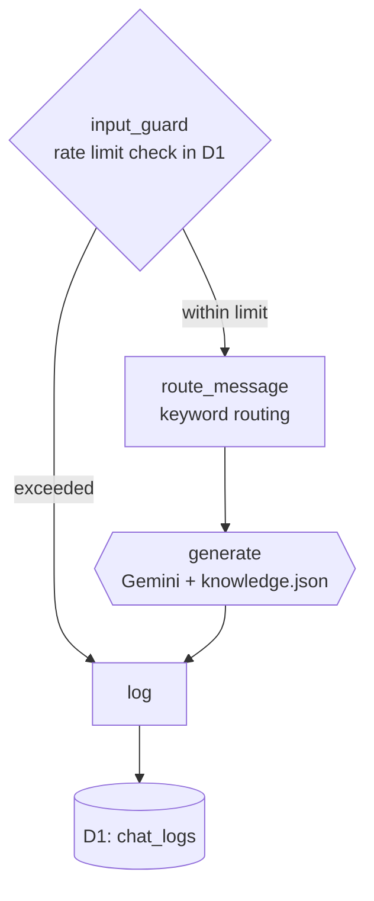

[🇯🇵 日本語](README.md) | [🇬🇧 English](README.en.md)

# folio-agent

[](https://github.com/yktsnet/folio-agent/actions/workflows/ci.yml)
[](https://www.npmjs.com/package/@folio-agent/widget)
[](https://www.npmjs.com/package/@folio-agent/handler)

npm packages that add a reception chatbot to a static site, answering only from the site's own content. There is no search layer: the site's full text is bundled into the system prompt at build time (CAG). Runs on Cloudflare Workers.

<p>
  
  
</p>

## Quick Start

### Prerequisites

- A Cloudflare account (Workers + D1)
- A static site that builds to `dist/`

### Setup

```bash
npm install @folio-agent/widget @folio-agent/handler
npx folio-agent-init
```

`folio-agent-init` prepares the config file, an API route scaffold, the ingest step in your `build` script, and `.dev.vars`. Paste the snippet it prints at the end (the widget tag) into your site's layout, once.

For manual setup and details on the config, handler, and widget, see [docs/usage.en.md](docs/usage.en.md).

## How It Works

- **Build time**: `folio-agent-ingest` picks pages from `dist/` and `knowledge/` (optionally Zenn articles) by URL glob, converts them to text, and writes `knowledge.json`, which ships in the same deployment as the site
- **Runtime**: the widget sends `POST /api/chat`, and the handler processes it in this order


```mermaid
flowchart TD
    Guard{"input_guard<br/>rate limit check in D1"}
    Guard -->|"within limit"| Route["route_message<br/>keyword routing"]
    Guard -->|"exceeded"| Log["log"]
    Route --> Generate{{"generate<br/>Gemini + knowledge.json"}}
    Generate --> Log
    Log --> D1[("D1: chat_logs")]
```

The widget makes no network request until it is clicked. Its colors follow the site's light / dark scheme automatically, and three colors — `surface` / `text` / `accent` — are enough to change them.

## Tech Stack

| Layer | Technology | Reason |
|---|---|---|
| Runtime | Cloudflare Workers + D1 | Free tier, `CF-Connecting-IP`, and D1 in one place, with no extra infrastructure |
| Flow | LangGraph.js (`StateGraph` only) | Expresses the guard → route → generate → log branching declaratively |
| Knowledge | CAG (no search) | For one site's worth of knowledge, a vector search stack is overkill |
| Knowledge selection | dist traversal + URL globs (`picomatch`) | No crawling; users only need to know their own site's URLs |
| Generation | Gemini API (default `gemini-3.1-flash-lite`) | A free tier that keeps an always-on bot at zero cost |
| Frontend | Web Components (Shadow DOM) | Works with any framework, with no CSS collisions |

## Design Decisions

Only the key points. The full text, including what was rejected and when to revisit, is in [docs/design-decisions.en.md](docs/design-decisions.en.md).

- **No search**: CAG is enough while the knowledge is small. The boundary for switching to RAG is known; this sits on the near side of it
- **Narrow target**: only static sites that build to `dist/` + Cloudflare Workers. Generalizing waits until users need it
- **Gemini free tier by default**: visitors are told on the disclosure page that input may be used for training
- **One D1 table for logs**: no consent button; a line below the input plus a link to a details page tells visitors. The rate limit counts the same log rows

## Scope

**Supported**

- Adding the chatbot to a static site that builds to `dist/` (Cloudflare Workers / Pages Functions)
- Build-time knowledge ingestion (URL globs, supplementary Markdown, Zenn articles)
- Per-IP rate limiting and logging to D1

**Not supported**

- Sites without a static build, hosts other than Cloudflare
- Authentication, saved conversations, languages other than ja / en
- Answering what the knowledge doesn't cover (it declines and points to Contact)

What the public API guarantees is listed in [docs/guarantees.md](docs/guarantees.md) (Japanese).

## Development

```bash
npm ci
npm run typecheck
npm test
npm run build
```

To exercise D1 and Gemini for real, use the dev harness in `packages/handler/dev/README.md`. The release procedure is in [docs/release.en.md](docs/release.en.md).

## License

[MIT](LICENSE)
