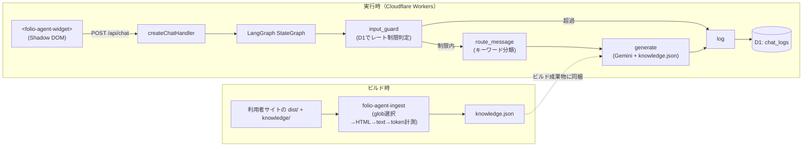

# folio-agent

[](https://github.com/yktsnet/folio-agent/actions/workflows/ci.yml)

静的サイト + Cloudflare Workers 向けに、知識全量をビルド時にシステムプロンプトへ同梱する **CAG（検索を持たないfull-context）方式**で答えるポートフォリオ受付チャットボットを提供する npm パッケージ。

> npm 公開済み。`npm install @folio-agent/widget @folio-agent/handler` で導入できます。

## Quick Start

### Prerequisites

- Cloudflare アカウント（Workers + D1）
- 対象サイトが静的ビルド（`dist/` を吐く）を持つこと

### Setup

```bash
npm install @folio-agent/widget @folio-agent/handler

# 知識ファイルの生成（ビルドのたびに実行）
npx folio-agent-ingest folio-agent.config.json knowledge.json
```

```jsonc
// folio-agent.config.json
{
  "distDir": "dist",
  "include": ["/", "/works/**", "/about"],
  "exclude": ["/works/draft-*"],
  "knowledgeDir": "knowledge"
}
```

Pages Function 側（`functions/api/chat.ts` 等）で `createChatHandler` を組み立て、フロントに `<folio-agent-widget>` を1行埋め込む。詳細は [Usage](#usage--api) を参照。

## Overview

知識源がサイト1つ+補足のMarkdown数本程度に収まる小規模なら、ベクトル検索基盤を用意するのは過剰になりやすい。folio-agentは検索を持たず、知識全量をビルド時にシステムプロンプトへ同梱するCAG（Cache-Augmented Generation）方式で回答する。知識が増えてきた場合はRAGへの切り替えを検討すべき境界がある（詳細は [Design Decisions](#design-decisions)）。

サイト本体の開発とは独立したnpmパッケージとして開発しており、実サイトへの組み込みで動作を検証しながら育てている。

## Architecture



## Tech Stack

| Layer | Technology | Reason |
|---|---|---|
| 実行基盤 | Cloudflare Workers | D1・`CF-Connecting-IP`・無料枠が Workers ネイティブで揃い、追加インフラなしで完結する |
| バックエンド | LangGraph.js（`StateGraph` のみ） | 入力ガード→ルーティング→生成→ログという分岐処理を `StateGraph` で宣言的に表現できる |
| 知識設計 | CAG（full-context、検索なし） | 知識源が小規模（サイト1つ+補足数本）で、ベクトル検索基盤を足すのは過剰という判断 |
| 知識指定 | dist走査 + URLパスグロブ（`picomatch`） | 読み取りはファイルアクセス（クロール不要）、指定子はURL（利用者は自サイトのURL構造だけ知っていればよい） |
| 生成 | Gemini API（既定 `gemini-3.1-flash-lite`） | 常時公開でコストゼロを維持する無料枠。詳細は [JUDGE.md §4](JUDGE.md) |
| フロント | Web Components（Shadow DOM、フレームワーク非依存） | 導入先のフレームワークを問わず、CSSスタイルの衝突も避ける |
| モノレポ | npm workspaces | 依存が軽い2パッケージ規模では pnpm の利点が効かず、追加ツール（corepack等）が要らない構成を優先。詳細は [JUDGE.md §11](JUDGE.md) |

## Usage / API

### 1. Knowledge Generation (build time)

```bash
npx folio-agent-ingest folio-agent.config.json knowledge.json
```

`IngestConfig`（`distDir` / `include` / `exclude` / `knowledgeDir` / `tokenWarningThreshold`）は `@folio-agent/handler` から型で公開されている。`knowledgeDir` に置いた Markdown は URL パスをミラーした構造で、include/exclude の対象外（明示配置したものだけが入る）。

### 2. Chat Handler (Pages Function / Worker)

```ts
import { createChatHandler, createGeminiGenerator } from "@folio-agent/handler";
import knowledgeDoc from "../knowledge.json";

const knowledge = knowledgeDoc.pages.map((p) => `# ${p.url}\n\n${p.text}`).join("\n\n");

interface Env {
  DB: D1Database;
  GEMINI_API_KEY: string;
}

export default {
  fetch: (request: Request, env: Env) =>
    createChatHandler({
      db: env.DB,
      generateAnswer: createGeminiGenerator({ apiKey: env.GEMINI_API_KEY, knowledge }),
    })(request),
};
```

D1 スキーマは `packages/handler/migrations/0001_init.sql` を `wrangler d1 migrations apply` で適用する。`chat_logs` テーブル1つがログとレート制限カウンタ（10分3問・日次10回、`rateLimitConfig` で変更可）を兼ねる。

### 3. Widget (frontend)

```html
<folio-agent-widget endpoint="/api/chat" policy-href="/data-policy"></folio-agent-widget>
<script type="module">
  import { defineFolioAgentWidget } from "@folio-agent/widget";
  defineFolioAgentWidget();
</script>
```

- `policy-href` の指し先ページには、①IPベースのレート制限（10分3問・日次10回）を行っていること、②入力内容と応答を D1 にログとして記録していること、③生成に使う Gemini API の無料枠は入力が学習に利用され得ることの3点を書く。ページ自体は導入サイト側の責務（folio-agent はテンプレートを同梱しない）。
- 配色・フォントは CSS カスタムプロパティ6トークン（`--folio-agent-surface` / `text` / `muted` / `accent` / `accent-contrast` / `font`）で上書きできる。未指定時は既定デザインのまま動く。

## Design Decisions

- **CAGを選ぶ理由**: 知識源がLLMのコンテキストに余裕で収まる規模では、検索基盤を足すのは過剰。知識が肥大した場合はRAGへ切り替えるべき境界が存在する。
- **独立OSS + dogfoodingを選ぶ理由**: サイト本体とは独立したnpmパッケージとして開発し、実サイトへの組み込みで動作を検証する。テンプレートリポは不採用（fork後の改善が届かずOSSとして育たないため）。v1のサポート対象は「distを吐く静的サイト + Cloudflare Workers」のみに限定し、汎用化は利用者が現れてから払う。
- **Cloudflare Workers + LangGraph.jsを選ぶ理由**: Astro/Next + Cloudflare/Vercelが主流の層に対し、npm install + wrangler deployで完結するTS製が導入障壁を最小にする。
- **知識指定を「dist走査 + URLグロブ」にする理由**: 実行時クロールや手書きの単一JSON知識ファイルは同期漏れが人手依存になるため避けた。
- **知識の配送をv1で同一デプロイに同梱する理由**: 知識をLLMのコンテキストに渡した時点で公開扱いとする原則のもと、生成場所と消費場所のズレを設計ごと無くす。Cloudflare外のサイト向け配送（案C）は将来追加できる境界だけ残す。

その他の判断（Gemini無料枠の枯渇時フォールバック・D1ログと開示・レート制限方式・ウィジェットUI/テーマ/プレーンテキスト方針・経路分類の決定的分岐・npm workspaces採用）は [JUDGE.md](JUDGE.md) を参照。

## Scope

**対応する**

- `dist/` を吐く静的サイト + Cloudflare Workers（Pages Functions）へのチャットボット組み込み
- ビルド時の知識取り込み（URLグロブ選択 + 補足Markdown）
- IPベースのレート制限とD1ログ

**対応しない**

- 静的ビルドを持たないサイト・Cloudflare以外のホスト（v1では非対応。将来の配送方式追加は [JUDGE.md §9](JUDGE.md) に境界のみ記載）
- 認証・認可、会話の永続セッション、多言語対応
- 知識に書かれていないことへの回答（無回答 + Contact誘導が既定の振る舞い）

## Development

```bash
npm ci
npm run typecheck   # tsc -b --force
npm test            # Vitest（全パッケージ）
npm run build       # tsc -b
```

D1 / Gemini を実際に使う手動検証は `packages/handler/dev/README.md` を参照（`wrangler dev` + ローカルD1で、v1の同一デプロイ構成を再現する使い捨てハーネス）。
