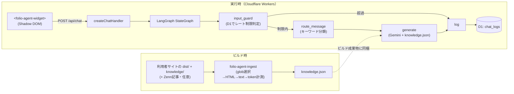

# folio-agent

[](https://github.com/yktsnet/folio-agent/actions/workflows/ci.yml)

静的サイト + Cloudflare Workers 向けに、知識全量をビルド時にシステムプロンプトへ同梱する **CAG（検索を持たないfull-context）方式**で答えるポートフォリオ受付チャットボットを提供する npm パッケージ。

> npm 公開済み。`npm install @folio-agent/widget @folio-agent/handler` で導入できます。

## Quick Start

### Prerequisites

- Cloudflare アカウント（Workers + D1）
- 対象サイトが静的ビルド（`dist/` を吐く）を持つこと

### Setup

```bash
npm install @folio-agent/widget @folio-agent/handler

# 知識ファイルの生成（ビルドのたびに実行）
npx folio-agent-ingest folio-agent.config.json knowledge.json
```

```jsonc
// folio-agent.config.json
{
  "distDir": "dist",
  "include": ["/", "/works/**", "/about"],
  "exclude": ["/works/draft-*"],
  "knowledgeDir": "knowledge"
}
```

Pages Function 側（`functions/api/chat.ts` 等）で `createChatHandler` を組み立て、フロントに `<folio-agent-widget>` を1行埋め込む。詳細は [Usage](#usage--api) を参照。

## Overview

知識源がサイト1つ+補足のMarkdown数本程度に収まる小規模なら、ベクトル検索基盤を用意するのは過剰になりやすい。folio-agentは検索を持たず、知識全量をビルド時にシステムプロンプトへ同梱するCAG（Cache-Augmented Generation）方式で回答する。知識が増えてきた場合はRAGへの切り替えを検討すべき境界がある（詳細は [Design Decisions](#design-decisions)）。

サイト本体の開発とは独立したnpmパッケージとして開発しており、実サイトへの組み込みで動作を検証しながら育てている。

## Architecture



## Tech Stack

| Layer | Technology | Reason |
|---|---|---|
| 実行基盤 | Cloudflare Workers | D1・`CF-Connecting-IP`・無料枠が Workers ネイティブで揃い、追加インフラなしで完結する |
| バックエンド | LangGraph.js（`StateGraph` のみ） | 入力ガード→ルーティング→生成→ログという分岐処理を `StateGraph` で宣言的に表現できる |
| 知識設計 | CAG（full-context、検索なし） | 知識源が小規模（サイト1つ+補足数本）で、ベクトル検索基盤を足すのは過剰という判断 |
| 知識指定 | dist走査 + URLパスグロブ（`picomatch`） | 読み取りはファイルアクセス（クロール不要）、指定子はURL（利用者は自サイトのURL構造だけ知っていればよい） |
| 生成 | Gemini API（既定 `gemini-3.1-flash-lite`） | 常時公開でコストゼロを維持する無料枠。詳細は [Design Decisions](#design-decisions) |
| フロント | Web Components（Shadow DOM、フレームワーク非依存） | 導入先のフレームワークを問わず、CSSスタイルの衝突も避ける |
| モノレポ | npm workspaces | 依存が軽い2パッケージ規模では pnpm の利点が効かず、追加ツール（corepack等）が要らない構成を優先。詳細は [Design Decisions](#design-decisions) |

## Usage / API

### 1. Knowledge Generation (build time)

```bash
npx folio-agent-ingest folio-agent.config.json knowledge.json
```

`IngestConfig`（`distDir` / `include` / `exclude` / `knowledgeDir` / `zenn` / `tokenWarningThreshold`）は `@folio-agent/handler` から型で公開されている。`knowledgeDir` に置いた Markdown は URL パスをミラーした構造で、include/exclude の対象外（明示配置したものだけが入る）。

Zenn 記事も知識に含める場合は `zenn` を指定する（省略すればスキップ）。zenn.dev への通信は行わず、Zenn CLI の `articles/` ディレクトリをローカルで読み、frontmatter が `published: true` の記事だけを取り込む:

```jsonc
// folio-agent.config.json（抜粋）
{
  "zenn": {
    "articlesDir": "../zenn-content/articles",
    "baseUrl": "https://zenn.dev/<username>/articles"
  }
}
```

### 2. Chat Handler (Pages Function / Worker)

```ts
import { createChatHandler, createGeminiGenerator } from "@folio-agent/handler";
import knowledgeDoc from "../knowledge.json";

const knowledge = knowledgeDoc.pages.map((p) => `# ${p.url}\n\n${p.text}`).join("\n\n");

interface Env {
  DB: D1Database;
  GEMINI_API_KEY: string;
}

export default {
  fetch: (request: Request, env: Env) =>
    createChatHandler({
      db: env.DB,
      generateAnswer: createGeminiGenerator({
        apiKey: env.GEMINI_API_KEY,
        knowledge,
        contactUrl: "https://example.com/contact",
      }),
    })(request),
};
```

`contactUrl` を渡すと、依頼・相談（inquiry）経路の回答が具体的な URL で Contact ページを案内する。省略した場合は URL なしで「Contactページ」とだけ案内する。

D1 スキーマは `packages/handler/migrations/0001_init.sql` を `wrangler d1 migrations apply` で適用する。`chat_logs` テーブル1つがログとレート制限カウンタ（10分3問・日次10回、`rateLimitConfig` で変更可）を兼ねる。

### 3. Widget (frontend)

```html
<folio-agent-widget endpoint="/api/chat" policy-href="/data-policy"></folio-agent-widget>
<script type="module">
  import { defineFolioAgentWidget } from "@folio-agent/widget";
  defineFolioAgentWidget();
</script>
```

- `policy-href` の指し先ページには、①IPベースのレート制限（10分3問・日次10回）を行っていること、②入力内容と応答を D1 にログとして記録していること、③生成に使う Gemini API の無料枠は入力が学習に利用され得ることの3点を書く。ページ自体は導入サイト側の責務（folio-agent はテンプレートを同梱しない）。
- 配色・フォントは CSS カスタムプロパティ6トークン（`--folio-agent-surface` / `text` / `muted` / `accent` / `accent-contrast` / `font`）で上書きできる。**未指定でもホストの配色（`color` / `color-scheme` 継承とCSSシステムカラー）から既定値を導出するため、サイトのライト/ダークどちらにも自然に馴染む**。変えたい場合のみ、上記トークンを上書きする。

## Design Decisions

- **CAGを選ぶ理由**: 知識源がLLMのコンテキストに余裕で収まる規模では、検索基盤を足すのは過剰。ベクトルDBとembeddingパイプラインを持たないことで壊れる部品が減り、利用者のセットアップも軽くなる。知識が肥大してコンテキスト・コスト・応答品質が劣化したらRAGへ切り替えるべき境界が存在し、境界を知った上で手前側を選ぶのが本リポの主張。作者の [order-system-migration](https://github.com/yktsnet/order-system-migration)（Text-to-SQL）・[order-system-rag](https://github.com/yktsnet/order-system-rag)（RAG）が「質問の性質」でツールを選んだのに対し、本リポは「知識の規模」で選ぶ第3の判断軸を実証する。
- **独立OSS + dogfoodingを選ぶ理由**: サイト本体とは独立したnpmパッケージとして開発し、実サイトへの組み込みで動作を検証する。ボットの知識はビルド時取り込みでサイトに自動追従するため、同期のための人手に依存しない。テンプレートリポは不採用（fork後の改善が届かずOSSとして育たないため）。v1のサポート対象は「distを吐く静的サイト + Cloudflare Workers」のみに限定し、汎用化のコスト（設定面の肥大・多フレームワーク対応）は利用者が現れてから払う。
- **Cloudflare Workers + LangGraph.jsを選ぶ理由**: Astro/Next + Cloudflare/Vercelが主流の層に対し、npm install + wrangler deployで完結するTS製が導入障壁を最小にする。Python + 別ホストは利用者に常駐サーバを要求する。素の関数呼び出しでなくLangGraphなのは、入力ガード→経路分岐→生成→ログというグラフ構造を宣言的に書けるため。バンドルサイズへの配慮として使うのはStateGraphのコアのみ。
- **Gemini無料枠を既定にする理由**: 常時公開でコストゼロを維持する。生成エンジンが何かは主題（CAGという知識設計）を揺るがさない。無料枠は入力が学習に使われ得るが、知識源は公開情報のみで、訪問者の入力もその前提を開示ページに明記するため許容。無料枠が枯渇した日は「本日の受付は終了 + Contact誘導」を返し、沈黙させない。
- **知識指定を「dist走査 + URLグロブ」にする理由**: 読み取りはファイルアクセス（クロール不要・ビルドと同居）、指定子はURL（利用者は自サイトのURL構造だけ知っていればよい）の合成。実行時クロールや手書きの単一JSON知識ファイルは同期漏れが人手依存になるため避けた。補足知識はURLパスをミラーした `knowledge/` ディレクトリに明示配置し、「入れたものだけ入る」を保つ。
- **知識の配送をv1で同一デプロイに同梱する理由**: 知識をLLMのコンテキストに渡した時点で公開扱いとする原則のもと、生成場所と消費場所のズレを設計ごと無くす。デプロイ1つで知識とサイトが原子的に一致し、追加トークンやKVが要らない。Cloudflare外のサイト向け配送（知識を静的アセットとして公開し独立Workerがfetchする方式）は、生成段階と配送段階を分離した境界だけ残して将来追加できるようにしている。
- **ログをD1に取り、同意ボタンを置かない理由**: ログは品質改善（質問傾向・Contact転換の把握）に直結し、無料枠・テーブル1つ・書き込み1行/会話で運用負荷はほぼない。IP + 入力内容は個人関連情報に当たり得るため、チャット初回の一文と詳細ページへのリンクで通知する。明示的同意の要求は一般のチャットウィジェットの水準に照らして過剰で、UXを損なうため置かない。
- **レート制限をD1ログの集計で行う理由**: `chat_logs` のCOUNTをそのままカウンタに流用し、別の仕組みを持たない。Workers Rate Limiting bindingは日次上限が表現しづらく、Durable Objectsはこの規模に過剰。上限は事前に掲げず、超過時に「上限に達しました。お急ぎはContactへ」と返して誘導に転化する。NATやモバイル回線で複数人が同一IPになる限界は、数字を環境変数で即調整できる形で吸収する。
- **ウィジェットを自前で書く理由**: 既製チャットウィジェットは重く、「クリックするまで一切主張しない」要件（自動ポップアップなし・初回吹き出しなし・未クリック時の通信なし）を制御しづらい。テーマはCSSカスタムプロパティで受ける（Shadow DOMでもhostから継承される標準機構で、利用側はグローバルCSS数行、未設定なら既定デザイン）。回答表示はプレーンテキスト固定とし、Markdownレンダラの重さとXSS面の管理コストを受付チャットの短文回答のために払わない。
- **経路分類をキーワードによる決定的分岐にする理由**: 経路判定に失敗しても実害が小さい（知識プロンプトは全経路共通で、違うのは口調・振る舞いの指示だけ）分岐に、追加のLLM呼び出し（レイテンシ・コスト・失敗点）を足さない。決定的なのでテストがキーワード→経路の対応表そのものになる。誤判定の兆候が増えたらLLM判定への切り替えを検討する。
- **npm workspacesを選ぶ理由**: 依存が軽い2パッケージ規模ではpnpmの利点（ディスク効率・厳密な依存解決）が効かず、Nodeさえあれば動く構成がコントリビュータへの制約を減らす。corepack前提の手順は権限の強い環境要求になるため避けた。パッケージ数が増えて実害が出たら再検討する。

## Scope

**対応する**

- `dist/` を吐く静的サイト + Cloudflare Workers（Pages Functions）へのチャットボット組み込み
- ビルド時の知識取り込み（URLグロブ選択 + 補足Markdown + Zenn記事）
- IPベースのレート制限とD1ログ

**対応しない**

- 静的ビルドを持たないサイト・Cloudflare以外のホスト（v1では非対応。将来の配送方式追加は [Design Decisions](#design-decisions) に境界のみ記載）
- 認証・認可、会話の永続セッション、多言語対応
- 知識に書かれていないことへの回答（無回答 + Contact誘導が既定の振る舞い）

## Development

```bash
npm ci
npm run typecheck   # tsc -b --force
npm test            # Vitest（全パッケージ）
npm run build       # tsc -b
```

D1 / Gemini を実際に使う手動検証は `packages/handler/dev/README.md` を参照（`wrangler dev` + ローカルD1で、v1の同一デプロイ構成を再現する使い捨てハーネス）。

## License

[MIT](LICENSE)
