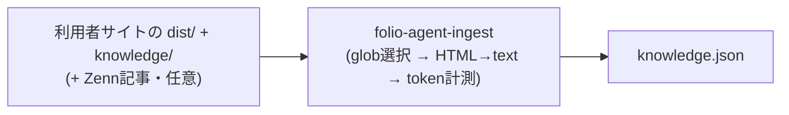
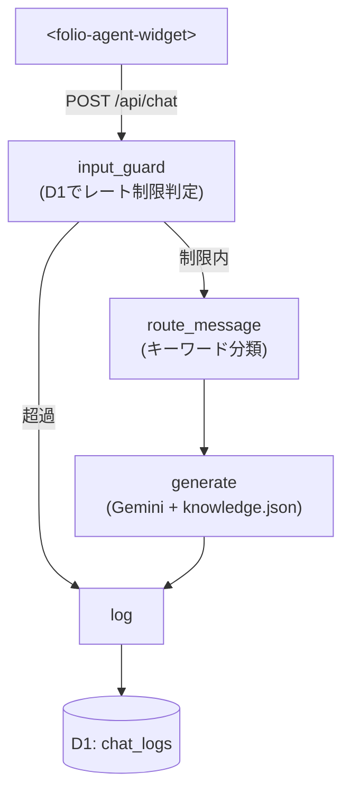

[🇯🇵 日本語](README.md) | [🇬🇧 English](README.en.md)

# folio-agent

[](https://github.com/yktsnet/folio-agent/actions/workflows/ci.yml)

静的サイト + Cloudflare Workers 向けに、知識全量をビルド時にシステムプロンプトへ同梱する **CAG（検索を持たないfull-context）方式**で答えるポートフォリオ受付チャットボットを提供する npm パッケージ。

> npm 公開済み。`npm install @folio-agent/widget @folio-agent/handler` で導入できます。

## Quick Start

### Prerequisites

- Cloudflare アカウント（Workers + D1）
- 対象サイトが静的ビルド（`dist/` を吐く）を持つこと

### Setup

```bash
npm install @folio-agent/widget @folio-agent/handler
npx folio-agent-init
```

`folio-agent-init` は対話ウィザード。言語（JA/EN）・知識に含める URL グロブ・Zenn 連携・Contact URL・テーマ3色・Gemini API キーを質問し、以下を生成・修正する:

- `folio-agent.config.json`（ingest 設定 + ウィザードの回答）
- `folio-agent.theme.css`（テーマ3色の CSS カスタムプロパティ）
- API ルートの雛形（既定 `functions/api/chat.ts`。既存ファイルには触らない）
- `package.json` の `build` スクリプトへの `folio-agent-ingest` 追記
- `.dev.vars` の `GEMINI_API_KEY`

手作業は1箇所だけ。完了時に表示されるスニペット（widget タグ + `folio-agent.theme.css` の読み込み）を、サイトのレイアウトへ初回のみ貼り付ける。

テーマの微調整は `folio-agent.theme.css` の編集か `npx folio-agent-init` の再実行で行い、自サイトの dev サーバーにそのまま反映される。再実行は全質問を現在値デフォルトで聞き直し、書き込み前に変更内容を確認できる。

ウィザードを使わず手で設定する場合は [Usage](#usage--api) を参照。

## Overview

知識源がサイト1つ+補足のMarkdown数本程度に収まる小規模なら、ベクトル検索基盤を用意するのは過剰になりやすい。folio-agentは検索を持たず、知識全量をビルド時にシステムプロンプトへ同梱するCAG（Cache-Augmented Generation）方式で回答する。知識が増えてきた場合はRAGへの切り替えを検討すべき境界がある（詳細は [Design Decisions](#design-decisions)）。

サイト本体の開発とは独立したnpmパッケージとして開発しており、実サイトへの組み込みで動作を検証しながら育てている。

## Architecture

**ビルド時**: 利用者サイトの成果物から知識ファイルを生成する。



**実行時（Cloudflare Workers）**: knowledge.json はビルド成果物としてサイトと同一デプロイに同梱され、`createChatHandler` が LangGraph StateGraph の4ノードで処理する。



## Tech Stack

| Layer | Technology | Reason |
|---|---|---|
| 実行基盤 | Cloudflare Workers | D1・`CF-Connecting-IP`・無料枠が Workers ネイティブで揃い、追加インフラなしで完結する |
| バックエンド | LangGraph.js（`StateGraph` のみ） | 入力ガード→ルーティング→生成→ログという分岐処理を `StateGraph` で宣言的に表現できる |
| 知識設計 | CAG（full-context、検索なし） | 知識源が小規模（サイト1つ+補足数本）で、ベクトル検索基盤を足すのは過剰という判断 |
| 知識指定 | dist走査 + URLパスグロブ（`picomatch`） | 読み取りはファイルアクセス（クロール不要）、指定子はURL（利用者は自サイトのURL構造だけ知っていればよい） |
| 生成 | Gemini API（既定 `gemini-3.1-flash-lite`） | 常時公開でコストゼロを維持する無料枠。詳細は [Design Decisions](#design-decisions) |
| フロント | Web Components（Shadow DOM、フレームワーク非依存） | 導入先のフレームワークを問わず、CSSスタイルの衝突も避ける |
| モノレポ | npm workspaces | 依存が軽い2パッケージ規模では pnpm の利点が効かず、追加ツール（corepack等）が要らない構成を優先。詳細は [Design Decisions](#design-decisions) |

## Usage / API

### 1. Knowledge Generation (build time)

```bash
npx folio-agent-ingest folio-agent.config.json knowledge.json
```

```jsonc
// folio-agent.config.json
{
  "distDir": "dist",
  "include": ["/", "/works/**", "/about"],
  "exclude": ["/works/draft-*"],
  "knowledgeDir": "knowledge"
}
```

`IngestConfig`（`distDir` / `include` / `exclude` / `knowledgeDir` / `zenn` / `tokenWarningThreshold`）は `@folio-agent/handler` から型で公開されている。`language` と `theme` は `folio-agent-init` がウィザードの回答を保持するためのフィールドで、ingest 自体は読まない。`knowledgeDir` に置いた Markdown は URL パスをミラーした構造で、include/exclude の対象外（明示配置したものだけが入る）。

Zenn 記事も知識に含める場合は `zenn` を指定する（省略すればスキップ）。zenn.dev への通信は行わず、Zenn CLI の `articles/` ディレクトリをローカルで読み、frontmatter が `published: true` の記事だけを取り込む:

```jsonc
// folio-agent.config.json（抜粋）
{
  "zenn": {
    "articlesDir": "../zenn-content/articles",
    "baseUrl": "https://zenn.dev/<username>/articles"
  }
}
```

### 2. Chat Handler (Pages Function / Worker)

```ts
import { createChatHandler, createGeminiGenerator } from "@folio-agent/handler";
import knowledgeDoc from "../knowledge.json";

const knowledge = knowledgeDoc.pages.map((p) => `# ${p.url}\n\n${p.text}`).join("\n\n");

interface Env {
  DB: D1Database;
  GEMINI_API_KEY: string;
}

export default {
  fetch: (request: Request, env: Env) =>
    createChatHandler({
      db: env.DB,
      generateAnswer: createGeminiGenerator({
        apiKey: env.GEMINI_API_KEY,
        knowledge,
        contactUrl: "https://example.com/contact",
      }),
    })(request),
};
```

`contactUrl` を渡すと、依頼・相談（inquiry）経路の回答が具体的な URL で Contact ページを案内する。省略した場合は URL なしで「Contactページ」とだけ案内する。

`language`（`"ja" | "en"`、既定 `ja`）は `createChatHandler`（上限通知の定型文・ルーティングキーワード）と `createGeminiGenerator`（システムプロンプト）の両方に渡す。片方だけ渡すと定型文とプロンプトの言語がずれる。

D1 スキーマは `packages/handler/migrations/0001_init.sql` を `wrangler d1 migrations apply` で適用する。`chat_logs` テーブル1つがログとレート制限カウンタ（10分3問・日次10回、`rateLimitConfig` で変更可）を兼ねる。

### 3. Widget (frontend)

```html
<folio-agent-widget endpoint="/api/chat" policy-href="/data-policy"></folio-agent-widget>
<script type="module">
  import { defineFolioAgentWidget } from "@folio-agent/widget";
  defineFolioAgentWidget();
</script>
```

- `lang="en"` を付けると UI 文言（プレースホルダ・送信ボタン・開示文・エラー文）が英語になる。未指定は日本語。
- `policy-href` の指し先ページには、①IPベースのレート制限（10分3問・日次10回）を行っていること、②入力内容と応答を D1 にログとして記録していること、③生成に使う Gemini API の無料枠は入力が学習に利用され得ることの3点を書く。ページ自体は導入サイト側の責務（folio-agent はテンプレートを同梱しない）。
- 配色・フォントは CSS カスタムプロパティ6トークン（`--folio-agent-surface` / `text` / `muted` / `accent` / `accent-contrast` / `font`）で上書きできる。**未指定でもホストの配色（`color` / `color-scheme` 継承とCSSシステムカラー）から既定値を導出するため、サイトのライト/ダークどちらにも自然に馴染む**。変えたい場合のみ、上記トークンを上書きする。

## Design Decisions

導入判断に効く要点のみ。各判断の全文（何を捨てたか・どの境界で再検討するか）は [docs/design-decisions.md](docs/design-decisions.md) にある。

- **CAG（検索なし）**: 知識源が小規模ならベクトル検索基盤は過剰。RAGへ切り替えるべき境界を知った上で、手前側を選ぶ。
- **v1 のスコープ限定**: サポート対象は「distを吐く静的サイト + Cloudflare Workers」のみ。汎用化のコストは利用者が現れてから払う。
- **Gemini 無料枠が既定**: 常時公開でコストゼロを維持する。入力が学習に使われ得る前提は、開示ページで訪問者に通知する。
- **ログは D1・同意ボタンなし**: チャット初回の一文と詳細ページへのリンクで通知する。レート制限もこのログの COUNT を流用し、別の仕組みを持たない。

## Scope

**対応する**

- `dist/` を吐く静的サイト + Cloudflare Workers（Pages Functions）へのチャットボット組み込み
- ビルド時の知識取り込み（URLグロブ選択 + 補足Markdown + Zenn記事）
- IPベースのレート制限とD1ログ

**対応しない**

- 静的ビルドを持たないサイト・Cloudflare以外のホスト（v1では非対応。将来の配送方式追加は [Design Decisions](#design-decisions) に境界のみ記載）
- 認証・認可、会話の永続セッション、ja / en 以外の言語
- 知識に書かれていないことへの回答（無回答 + Contact誘導が既定の振る舞い）

## Development

```bash
npm ci
npm run typecheck   # tsc -b --force
npm test            # Vitest（全パッケージ）
npm run build       # tsc -b
```

D1 / Gemini を実際に使う手動検証は `packages/handler/dev/README.md` を参照（`wrangler dev` + ローカルD1で、v1の同一デプロイ構成を再現する使い捨てハーネス）。

### リリース手順

npm publish は `v*` タグの push をトリガーに GitHub Actions（`.github/workflows/release.yml`）が実施する。認証は npm の Trusted Publishing（OIDC）で、secrets にトークンは置かない。

1. main で `npm version <x.y.z> -w @folio-agent/handler -w @folio-agent/widget --no-git-tag-version` を実行し、2パッケージのバージョンを揃えてコミットする。
2. `git tag v<x.y.z>` を push する。
3. CI が typecheck / test / build を通した上で `npm publish --provenance` を実行する（タグと package.json のバージョンが不一致だとジョブ冒頭で fail する）。

初回のみ、npmjs.com のパッケージ設定（`@folio-agent/handler` / `@folio-agent/widget` それぞれ）で Trusted Publisher に GitHub Actions・リポジトリ `yktsnet/folio-agent`・ワークフローファイル `release.yml` を登録しておく。

## License

[MIT](LICENSE)
