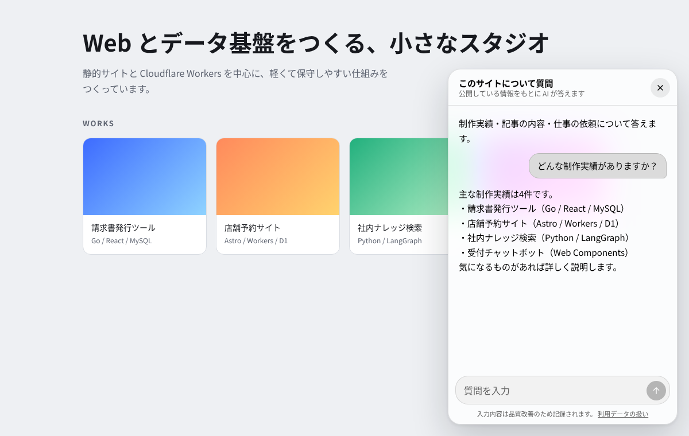
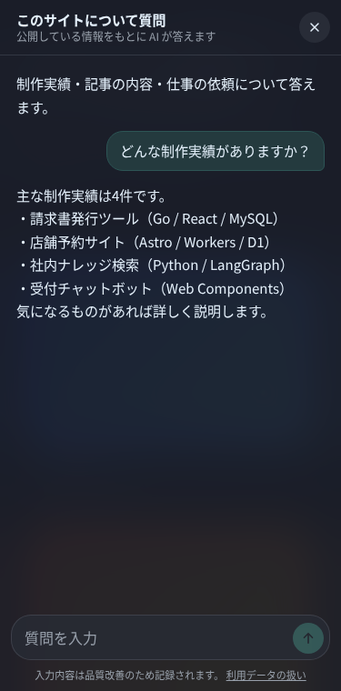
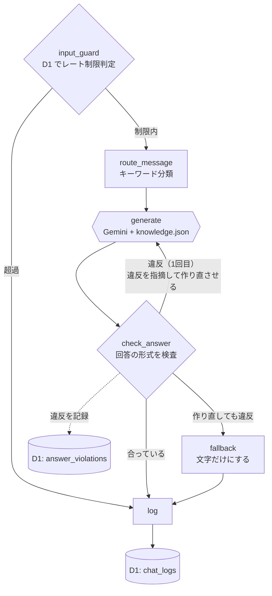

[🇯🇵 日本語](README.md) | [🇬🇧 English](README.en.md)

# folio-agent

[](https://github.com/yktsnet/folio-agent/actions/workflows/ci.yml)
[](https://www.npmjs.com/package/@folio-agent/widget)
[](https://www.npmjs.com/package/@folio-agent/handler)

静的サイトに、サイトの内容だけをもとに答える受付チャットボットを足す npm パッケージ。検索基盤は持たず、サイトの全文をビルド時にシステムプロンプトへ同梱して答える（CAG）。Cloudflare Workers で動く。

<p>
  
  
</p>

## Quick Start

### Prerequisites

- Cloudflare アカウント（Workers + D1）
- ビルドで `dist/` を出力する静的サイト

### Setup

```bash
npm install @folio-agent/widget @folio-agent/handler
npx folio-agent-init --include "/,/works/**,/about" --contact-url https://example.com/contact
```

`folio-agent-init` は対話を持たず、引数だけで設定ファイル・API ルートの雛形・`build` スクリプトへの ingest の追記・`.dev.vars` を用意する。再実行すると、渡さなかった値は前回のまま残る。Gemini API キーは引数では受け取らず、環境変数 `GEMINI_API_KEY` があれば `.dev.vars` に書く。最後に表示されるスニペット（widget のタグ）を、サイトのレイアウトへ1度だけ貼る。

引数の一覧（`npx folio-agent-init --help`）、手で設定する手順、config・handler・widget の詳細は [docs/usage.md](docs/usage.md) にある。導入を AI エージェントに任せる場合も、この README と docs/usage.md を読ませれば足りる。

## How It Works

- **ビルド時**: `folio-agent-ingest` が `dist/` と `knowledge/`（任意で Zenn 記事）から URL グロブで対象を選び、テキストにして `knowledge.json` へ書き出す。サイトと同じデプロイに同梱される
- **実行時**: widget が `POST /api/chat` を送り、handler が次の順に処理する


```mermaid
flowchart TD
    Guard{"input_guard<br/>D1 でレート制限判定"}
    Guard -->|"制限内"| Route["route_message<br/>キーワード分類"]
    Guard -->|"超過"| Log["log"]
    Route --> Generate{{"generate<br/>Gemini + knowledge.json"}}
    Generate --> Check{"check_answer<br/>回答の形式を検査"}
    Check -->|"合っている"| Log
    Check -->|"違反（1回目）<br/>違反を指摘して作り直させる"| Generate
    Check -->|"作り直しても違反"| Fallback["fallback<br/>文字だけにする"]
    Fallback --> Log
    Check -.->|"違反を記録"| Violations[("D1: answer_violations")]
    Log --> D1[("D1: chat_logs")]
```

widget はクリックされるまで通信しない。配色はサイトのライト／ダークに自動で合わせ、変える場合も `surface` / `text` / `accent` の3色で足りる。

## Tech Stack

| Layer | Technology | Reason |
|---|---|---|
| 実行基盤 | Cloudflare Workers + D1 | 無料枠・`CF-Connecting-IP`・D1 が揃い、追加のインフラが要らない |
| 処理の流れ | LangGraph.js（`StateGraph` のみ） | 入力ガード→分類→生成→検査→（作り直し）→ログの分岐とループを宣言的に書ける |
| 知識 | CAG（検索なし） | 知識がサイト1つ分なら、ベクトル検索基盤は過剰 |
| 知識の選び方 | dist 走査 + URL グロブ（`picomatch`） | クロールが要らず、利用者は自サイトの URL だけ知っていればよい |
| 生成 | Gemini API（既定 `gemini-3.1-flash-lite`） | 常時公開でもコストがかからない無料枠 |
| フロント | Web Components（Shadow DOM） | 導入先のフレームワークを問わず、CSS も衝突しない |

## Design Decisions

要点だけ示す。何を捨てたか・どこで再検討するかまで含めた全文は [docs/design-decisions.md](docs/design-decisions.md) にある。

- **LLM に任せるのは文章の中身だけ**: 回答の形式と参照先はプロンプトで頼むだけにせず、生成の後ろの `check_answer` がコードで検査する。違反は LLM に指摘して1回だけ作り直させ、それでも残れば文字だけにして返す。違反は記録し、多い間違いだけをプロンプトやコードで手当てする
- **検索を持たない**: 知識が小さいうちは CAG で足りる。RAG へ切り替えるべき境界は把握したうえで、手前側を選んでいる
- **対象を絞る**: ビルドで `dist/` を出力する静的サイト + Cloudflare Workers だけに対応する。汎用化は利用者が現れてから考える
- **既定は Gemini の無料枠**: 入力が学習に使われ得ることは、開示ページで訪問者に伝える
- **ログは D1 に1テーブル**: 同意ボタンは置かず、入力欄の下の一文と詳細ページへのリンクで伝える。レート制限もこのログの件数で数える

## Scope

**対応する**

- ビルドで `dist/` を出力する静的サイトへのチャットボットの組み込み（Cloudflare Workers / Pages Functions）
- ビルド時の知識の取り込み（URL グロブ・補足の Markdown・Zenn 記事）
- IP 単位のレート制限と D1 へのログ

**対応しない**

- 静的ビルドを持たないサイト、Cloudflare 以外のホスト
- 認証、会話の保存、ja / en 以外の言語
- 知識に無いことへの回答（答えずに Contact へ案内する）

公開 API が何を保証するかは [docs/guarantees.md](docs/guarantees.md) にある。

## Development

```bash
npm ci
npm run typecheck
npm test
npm run build
```

D1 と Gemini を実際に使う確認は `packages/handler/dev/README.md` の dev ハーネスで行う。リリース手順は [docs/release.md](docs/release.md)。

## License

[MIT](LICENSE)
